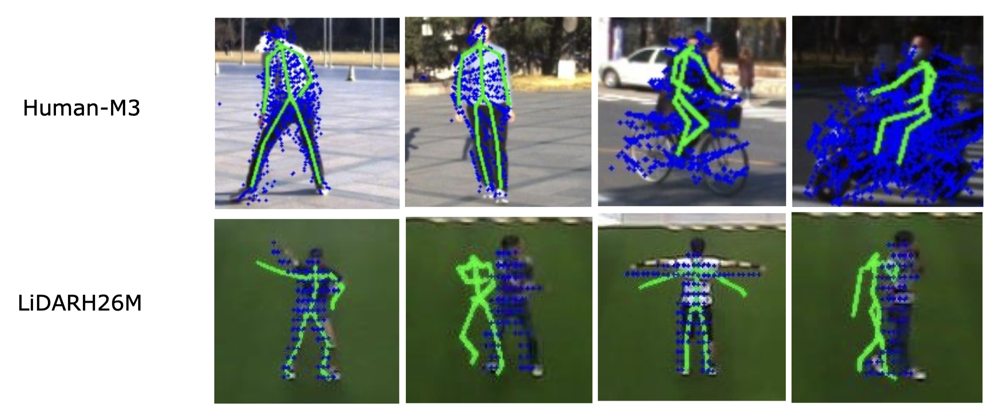
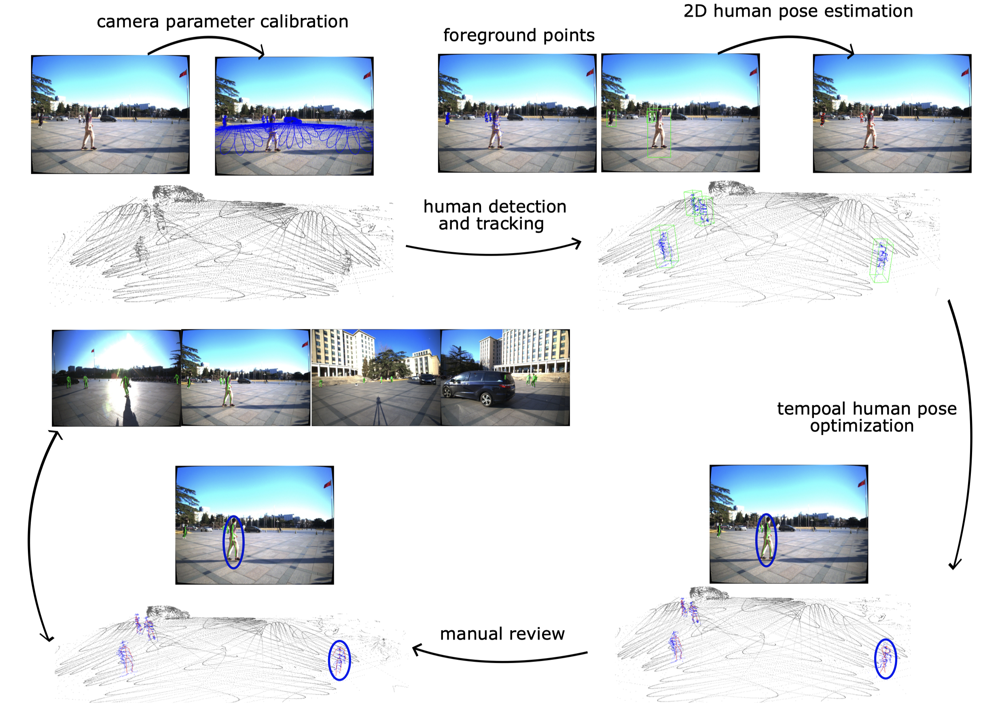
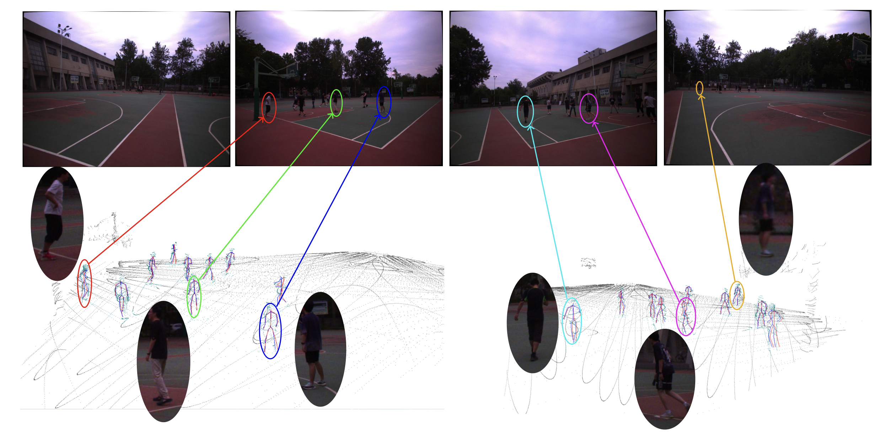

# Human-M3: A Multi-view Multi-modal Dataset for 3D Human Pose Estimation in Outdoor Scenes
Code and Data for Human-M3: A Multi-view Multi-modal Dataset for 3D Human Pose Estimation in Outdoor Scenes.
Coming Soon.

### [Paper](https://arxiv.org/abs/2308.00628) | [Project Page](https://github.com/soullessrobot/Human-M3-Dataset) | [Data]()

🔥 **News**: ```2023/12/10``` Human-M3 dataset is now available!


## Introduction

3D human pose estimation in outdoor environments has garnered increasing attention recently. However, prevalent 3D human pose datasets pertaining to outdoor scenes lack diversity, as they predominantly utilize only one type of modality (RGB image or pointcloud), and often feature only one individual within each scene. This limited scope of dataset infrastructure considerably hinders the variability of available data. In this article, we propose Human-M3, an outdoor multi-modal multi-view multi-person human pose database which includes not only multi-view RGB videos of outdoor scenes but also corresponding pointclouds. In order to obtain accurate human poses, we propose an algorithm based on multi-modal data input to generate ground truth annotation. This benefits from robust pointcloud detection and tracking, which solves the problem of inaccurate human localization and matching ambiguity that may exist in previous multi-view RGB videos in outdoor multi-person scenes, and generates reliable ground truth annotations. Evaluation of multiple different modalities algorithms has shown that this database is challenging and suitable for future research. Furthermore, we propose a 3D human pose estimation algorithm based on multi-modal data input, which demonstrates the advantages of multi-modal data input for 3D human pose estimation.

## Data




If you want this dataset, please send an e-mail to fbh19@mails.tsinghua.edu.cn, including full name, organization, country and the purpose for downloading the dataset. By sending the e-mail you accept the following license:

You may use the codes and data for research only, including sharing and modifying the material. You may do so in any reasonable manner, but not in any way that suggests the licensor endorses you or your use.

## Data Annotation Pipeline



## Benchmark




## Evaluation code
Installation:
```
pip install -r requirements.txt
```
Training:
Edit config files with 'ROOT' and 'ROOT_POSE2D' terms.
'ROOT_POSE2D' folder should include corresponding 2D pose estimation results by [openpifpaf](https://github.com/openpifpaf/openpifpaf).
Models can be trained by:
```
bash train_multimodal.sh
```
## Citation

If you find this project helpful, please consider citing the following paper:
```
@article{fan2023human,
    title={Human-M3: A Multi-view Multi-modal Dataset for 3D Human 
Pose Estimation in Outdoor Scenes},
    author={Fan, Bohao and Wang, Siqi and Zheng, Wenzhao and Feng, Jianjiang and Zhou, Jie},
    journal={arXiv preprint arXiv:2308.00628},
    year={2023}
}
```

